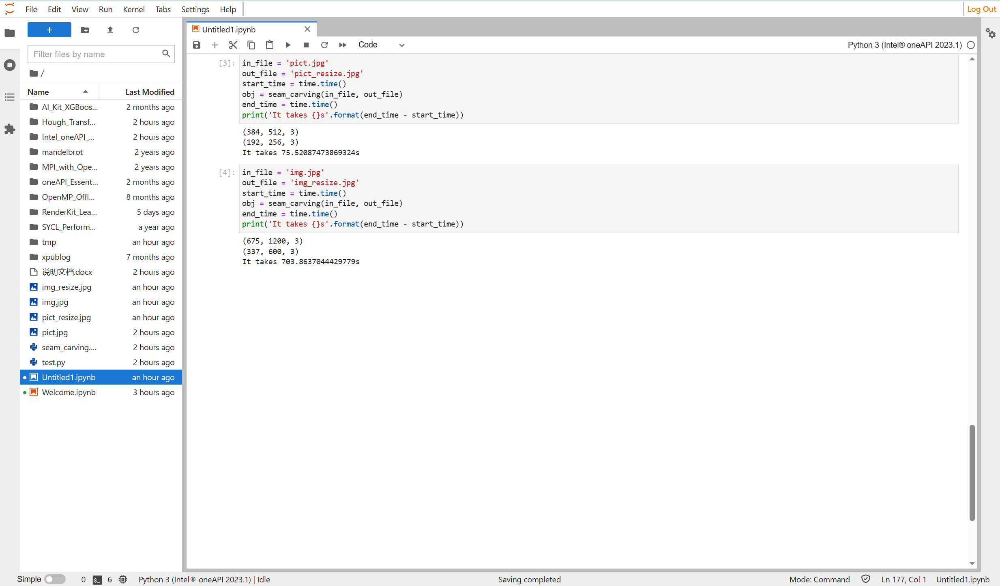
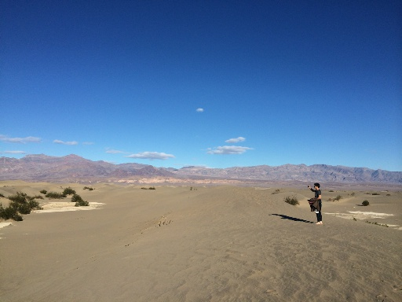

### 英特尔oneAPI简介
英特尔oneAPI是一种软件开发工具套件，旨在通过统一的编程模型简化跨不同硬件架构（包括CPU、GPU、FPGA和AI加速器）进行高性能计算的过程。它提供了一组库、编译器、调试工具和分析器，有助于开发人员更轻松地创建可移植的代码，以便在各种硬件平台上获得最佳性能。

在传统的硬件架构中，开发人员需要针对不同的硬件平台编写不同的代码，这会导致开发时间和维护成本的增加，并且还无法充分利用各种硬件加速器的性能。因此，oneAPI意在解决这个问题，使开发人员能够使用单一代码库进行编程，而无需为每个硬件平台编写不同的代码。这可以大大减少开发时间和维护成本，并使应用程序能够充分利用硬件加速器的性能。

oneAPI采用了一种基于数据并行的编程模型，这种模型可以让计算机处理大量数据并将其分成小块，然后将这些小块分配到多个处理器上进行并行计算。这种方式可以提高计算效率，并使得处理大规模数据集变得更加容易。

oneAPI支持多种编程语言，包括C++、Fortran和数据并行的Python和DPC++等。其中DPC++是一种新兴的语言，它结合了传统的C++语言和SYCL标准，可以轻松地进行各种硬件平台上的开发。此外，oneAPI还提供了多种库，包括数学库、线性代数库、图形库和数据分析库等，可以帮助开发人员更加轻松地实现各种算法和应用程序。

除此之外，oneAPI还提供了一些工具，如Intel Advisor和Intel VTune Profiler等，可以帮助开发人员确定瓶颈，并优化其代码以获得更好的性能。这些工具可以帮助开发人员更快地将其应用程序移植到不同的硬件平台上，并在运行时进行调试和优化。

总之，英特尔oneAPI是一个全面的软件开发工具套件，旨在帮助开发人员更轻松地创建高性能、可移植的应用程序。它采用了一种基于数据并行的编程模型，支持多种编程语言和库，还提供了一些有用的工具，可以帮助开发人员快速将其应用程序移植到不同的硬件平台上，并实现最佳性能。
### 英特尔DevCloud简介
英特尔DevCloud是由英特尔提供的一款云计算平台，为开发者提供了基于云技术的开发环境，满足用户在不同领域、不同层次的需求。DevCloud的最大优势是高效的计算资源和众多软件开发工具，它可以提供英特尔最新的处理器、内存、网络和存储等硬件资源，并且集成了编译器、调试器、性能分析工具等软件开发工具，让开发人员更加专注于应用程序的开发，而无需考虑硬件和软件环境的配置和管理问题。

通过在DevCloud上进行开发，测试和优化，用户可以更快地将他们的想法转化为实际应用程序。DevCloud还提供了多种操作系统和编程语言的支持，例如Linux、Windows、Python、C++等，以满足不同开发人员的需求。此外，DevCloud还具有动态扩展功能，可以根据用户的需求自动扩展计算资源，从而进一步提升开发的效率和速度。

DevCloud在多个领域和场景下都得到了广泛的应用，例如人工智能、机器学习、深度学习、云计算和物联网等领域，以及各种类型的应用程序开发过程中。DevCloud不仅可以提供高效的计算资源和软件工具，还可以根据用户的需求提供技术支持和专家咨询服务，使用户能够更好地利用这些资源进行应用程序的开发。

总之，英特尔DevCloud是一款非常强大和灵活的云计算平台，可以帮助开发者高效地开发、测试和优化各种应用程序，为全球的开发人员提供了一个方便、高效、简单的开发环境。
### Seam Carving算法
Seam Carving算法是一种图像处理算法，用于改变图像的大小。与传统的缩放算法不同，Seam Carving算法可以智能地压缩或扩展图像，以保持图像的主要内容和特征。

该算法通过计算每个像素和其周围像素之间的能量值，并构建出一个能量函数图。该图中的每个像素都有一个能量值，表示其对图像信息的重要性。根据这些能量值，算法可以找到一条绕过能量值最高的路径（称为“seam”），即在图像中选择最少的像素以达到所需的尺寸。

通过多次执行这个过程，即删减或插入seam，图像的大小就会改变。当需要缩小图像时，算法会删除一些seam，当需要放大图像时，算法会插入新的seam。由于算法只是删除或插入能量值最低的seam，因此可以确保图像中的重要信息和特征不会被破坏。

Seam Carving算法不仅适用于图像缩放，还可以应用于其他领域，如视频编辑、设计和人脸识别等，以及各种其他图像操作，如图像修复和去除水印等。

总之，Seam Carving算法是一种智能的图像处理算法，通过计算每个像素之间的能量值，并使用该能量函数图找到最小能量路径来改变图像的大小，从而保留图像原始信息和特征。
#### 问题描述
处理图片速度较慢的原因
- 需要处理大量的数据：Seam Carving算法需要对图像中每个像素的能量值进行计算，这样就需要对整个图像进行扫描，而如果图像分辨率很高或者需要处理大型图像，则需要处理的数据量非常大，导致算法运行缓慢。

- 算法复杂度高：Seam Carving算法的时间复杂度为O(nmP)，其中n和m是图像的宽度和高度，P是像素内部运算的复杂度。这意味着，处理一张大图像需要花费很长时间，并且在进行多次操作时，速度会变得更加缓慢。

- 需要高性能的计算机硬件：Seam Carving算法需要对每个像素进行计算，并且进行多次操作，因此需要高性能的计算机硬件，包括快速的CPU、大量的内存和高速的硬盘。如果硬件资源不足，则算法处理速度会明显降低。

程序实现不优化：程序实现不够优化也可能导致算法处理速度慢。例如，在计算每个像素的能量值时，可以使用一些优化技巧，如缓存、并行计算等，来提高算法的效率。
#### 算法描述
##### 求解能量图
```py
def calc_energy_map(self):
        b, g, r = cv2.split(self.out_image)
        b_energy = np.absolute(cv2.Scharr(b, -1, 1, 0)) + np.absolute(cv2.Scharr(b, -1, 0, 1))
        g_energy = np.absolute(cv2.Scharr(g, -1, 1, 0)) + np.absolute(cv2.Scharr(g, -1, 0, 1))
        r_energy = np.absolute(cv2.Scharr(r, -1, 1, 0)) + np.absolute(cv2.Scharr(r, -1, 0, 1))
        return b_energy + g_energy + r_energy
```
这里使用了OpenCV库的cv2.Scharr滤波器计算了每个像素的能量值，然后将蓝色、绿色和红色通道的能量值相加得到最终的能量图。
具体实现步骤如下：
- 使用cv2.split()函数将图像分离为蓝色、绿色和红色三个通道。
- 对每个通道分别使用cv2.Scharr()函数进行垂直和水平方向上的Sobel运算，得到该通道中每个像素的垂直和水平方向上的梯度，即该像素的能量值。
- 对每个通道的能量图进行相加，得到最终的能量图。
##### 动态规划计算代价和路径图
```py
# 动态规划填写dp数组以及记录由来方向
    # 输入：能量图
    # 输出：动态规划数组、回溯路径数组
    def cumulative_map_forward(self, energy_map):
        m, n = energy_map.shape
        dp = np.copy(energy_map)
        # 记录从哪来的，-1左上，0上，1右上
        path = np.zeros((m, n))
        # 从上到下
        for i in range(1, m):
            for j in range(n):
                # 第一列没有左上
                if j == 0:
                    # 取上
                    if energy_map[i - 1, j] < energy_map[i - 1, j + 1]:
                        path[i, j] = 0
                        dp[i, j] = energy_map[i, j] + energy_map[i - 1, j]
                    # 取右上
                    else:
                        path[i, j] = 1
                        dp[i, j] = energy_map[i, j] + energy_map[i - 1, j + 1]
                # 最后一列没有右上
                elif j == n - 1:
                    # 取左上
                    if energy_map[i - 1, j - 1] < energy_map[i - 1, j]:
                        path[i, j] = -1
                        dp[i, j] = energy_map[i, j] + energy_map[i - 1, j - 1]
                    # 取上
                    else:
                        path[i, j] = 0
                        dp[i, j] = energy_map[i, j] + energy_map[i - 1, j]
                # 中间的有三个来源方向
                else: 
                    # 取左上
                    if energy_map[i - 1, j - 1] < min(energy_map[i - 1, j], energy_map[i - 1, j + 1]):
                        path[i, j] = -1
                        dp[i, j] = energy_map[i, j] + energy_map[i - 1, j - 1]
                    # 取上
                    elif energy_map[i - 1, j] < energy_map[i - 1, j + 1]:
                        path[i, j] = 0
                        dp[i, j] = energy_map[i, j] + energy_map[i - 1, j]
                    # 取右上
                    else:
                        path[i, j] = 1
                        dp[i, j] = energy_map[i, j] + energy_map[i - 1, j + 1]
        return dp, path
```
这段代码实现了Seam Carving算法中的正向动态规划过程，它基于一个能量图（energy_map）进行计算，以得到每个像素选择从哪个方向来的路径时，从该像素出发到底需要多少的能量。

具体来说，这个函数使用了一种叫做DP（动态规划）的思想，即将整张图片看成是一个网格图，而这个网格图的每个格子就代表图片里的一个像素。这个函数从上到下、从左到右遍历每一个像素，对其中的每一个像素进行如下的处理：

- 如果当前像素是第一列的像素，那么该像素只能接受上面一个像素的能量值，因为在第一列左边是没有像素的，所以只能选择上方像素作为前继。
- 如果当前像素是最后一列的像素，那么该像素只能接受左上方和上方两个像素的能量值，因为在最后一列右边是没有像素的，所以只能选择左上和上方像素中能量值较小的一个作为前继。
- 如果当前像素不在第一列和最后一列之间，那么该像素可以接受左上方、上方和右上方三个像素的能量值，并且要选择其中能量值最小的那个像素作为前继。

通过记录回溯路径数组path来保存从哪个方向过来的能量更小。最终返回的是动态规划数组dp和回溯路径数组path。

动态规划的目的是为了计算从顶部到底部所有像素的能量值最小的缩放路径，该路径所包含的像素即为要删除的像素，通过动态规划可以选出能量值最小的路径，并删除这条路径上的像素，再更新能量图，重复该过程，直到达到期望的图像大小。
##### 回溯求代价和最少的路径
```py
# 通过回溯路径数组找seam位于每行的第几列
    # 输入：动态规划数组、回溯数组
    # 输出：seam位于每行的列号数组
    def find_seam(self, dp, path):
        m, n = dp.shape
        seam_idx = np.zeros((m, ), dtype=np.uint32)
        # 终点最小值对应的索引
        seam_idx[-1] = np.argmin(dp[-1])
        # 逆向寻找最小的路径
        for i in range(m - 2, -1, -1):
            j = seam_idx[i + 1]
            seam_idx[i] = j + path[i, j]

        print(seam_idx)
        sys.exit()
        return seam_idx
```
这段代码实现了通过回溯路径寻找每个像素在seam中属于哪一列的功能，即对于每一行的像素，通过从动态规划的最后一行（也就是底部）开始，沿着回溯路径往回找到每个像素在seam中应该位于哪一列，并记录下来。

具体来说，该函数接受两个输入参数：一个是动态规划数组dp，另一个是回溯路径数组path。其中，dp用于记录从图片顶部到每个像素的最小能量值，而path用于记录从哪个方向过来的能量更小。

该函数首先定义了一个m*n的数组seam_idx，用于保存每行中seam的位置，然后从最后一行开始，找出该行能量值最小的像素所在的列号，并将该列号保存在seam_idx中。接着，从倒数第二行开始（也就是倒数第一行上面的那一行），依次往上遍历每一行的像素，使用该行下面那个像素在seam中的位置

seam_idx[i+1]以及该像素的回溯路径信息path[i, j]，计算出该像素在seam中应该位于哪一列，并将其记录在seam_idx[i]中。
### 实验
在JupyterLab*中进行
#### 实验截图

#### 图片缩放前

#### 图片缩放后

